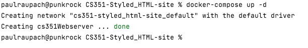
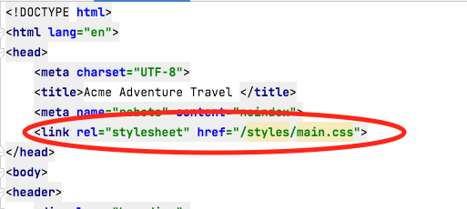
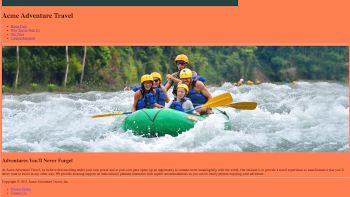

# Styled HTML Website Assignment. 

In this assignment you'll be styling the travel website you marked up with HTML in the last assignment.  Later we'll be useing this site as a template of a dynamic site we develop using a database and Ruby on Rails backend. 


## Hints for your sanity:
1. You're going to need to modify your HTML, that's okay.  In fact it's part of the process and is expected.  HTML and CSS go together.  You'll want to add class and id attributes to your html tags to make them easy to select using css selectors.  You'll want to put div and span tags around content so that you can style it.
2. Start with the big stuff first, layout, Color Pallet, Fonts.  You'll make a log of headway on all the pages by getting this part done first.
3. Don't try to do it all at once.  It's too much, you'll need to walk away from it from time to time.
4. I'm not expecting you to be a designer, your site doesn't have to be the most beautiful site on the net.  Just that you can demonstrate you understand how to apply these css styles.
5. This is a lot of work, however it's not particularly difficult.  Web design is a lot of work and one of those skill that is easy to learn and very hard to master. Give your self time to get it done with breaks.

## Set up.
1. Clone the assignment to your computer and make sure Docker is up and running on your computer. 
2. Make sure previous docker assignments and examples are not running. `docker container ls`. if there are any you'll need to stop them so they don't conflict with this assignment.
3. Build the docker images with `docker-compose build` 
4. Start up the container with `docker-compose up -d` 
5. Check the URL `localhost:8080` in a web browser to make sure the website is running. 
6. Next you need to copy all the files you create in the last assignment into this assignment, so you can style it. Copy all the contents in `website` directory from the last assignment to this one.  The `public-html` and `cgi-bin` directories should be completely copied from the previous assignment. 
7. Check the `localhost:8080` so make sure you're seeing all the files from your previous assignment. 
8. Create a new directory in the `public-html` directory called `styles`.
9. Copy the `main.css` file from the root of the assignment directory into the new `styles` directory. 
10. Open the `index.html` file in the `public-html` directory and apply the 'main.css' stylesheet to the home page by adding `<link rel="stylesheet" href="/styles/main.css">` the html inside the `head` tags. 
11. Refresh the `http://localhost:8080/` page in your web browser, you should see that the site now has a "coral" background color. 
12. If you are seeing the coral background then you know you've got the stylesheet properly linked to the home webpage.  You'll need to add the link the `main.css` to all your pages.  At this point you're ready to begin styling your travel site. 
13. Begin working on styling your site.  When you want to take a break your can run `docker-compose down` to stop the docker container. Just use `docker-compose up -d` to start it up when you're ready to continue working on it.


## Styling the Website
### Layout

Your website should follow a standard layout using a grid system.  And should be mobile friendly.  
1. If you followed the template from the HTML assignment you can begin by adding the following css to layout the homepage:

    ```
   body {
   display: grid;
   grid-template-columns: 3fr 1fr;
   grid-template-areas:
   "header header"
   "content content"
   "footer footer";
   gap: 10px;
   }

    header {
      grid-area: header;
    }
    main {
      grid-area: content;
    }
    footer {
      grid-area: footer;
    }
   ```
   It will look largely the same but if you view it using the developer tools in your web browswer you'll be able to see the grid.  This is just an exmple for the for home page. Other pages will be more complicated.
2. **Your site must be mobile friendly.** Remember to start with a mobile layout and then use `@media screen and (min-width: 768px) { ... }` to define the parts of the CSS that are different for the desktop.

### Color Scheme

I don't expect any of you to be designers, and I will not grade you on the appeal of your color scheme but rather on demonstrating that you are able to apply one.  With that said have some pride in your work and try to pick a color scheme that isn't hard to look at, after all you'll be stuck with it for the next few assignments.  There are many websites out there that can give you color pallets to use and examples of how to use them.  Pick a 3-5 color pallet and play with applying it to your site.  You should set a background color for the overall site, a text color for the content in the site.  You can make headers and content containers have different background and text colors.  You should also play with applying colors to borders. 

Here are some websites I found that have nice color combinations for you to use:
* https://hookagency.com/blog/website-color-schemes/
* https://designshack.net/articles/trends/best-website-color-schemes/
* https://websitesetup.org/website-color-schemes/

### Font Family
Apply a font-family stack with fall back to font styles that will be available on all major browsers.  Pick a Font that you like and if fairly common then make sure you've set up a font family with fallbacks so it can be viewed on any browser.  See: https://developer.mozilla.org/en-US/docs/Web/CSS/font-family

### Box Model
Demonstrate an understanding of the box model by setting margin, border and padding elements in your site. See https://developer.mozilla.org/en-US/docs/Learn/CSS/Building_blocks/The_box_model

### Page Specific requirements

#### Why Travel with us
The why travel with us page is a good place to experiment with a classic layout.  Use h1 through h5 tags and p tags to layout the page with headers and paragraphs then style the padding and spacing nicely so the page is easy to read. Remember that a page should only have 1 h1 tag and h2-h5 should be ordered properly in the page flow from top to bottom. 

### Trips list page
Use a flex layout to show trip "cards" on the trips page that lists the trips.  You should be able to have number of trips that display on a line automatically adjust to the window size. In the future we'll have way more than 5 trips showing on this page.  The trips cards should contain the trips title, and intro text and image, and should link to the trip pages. See: https://developer.mozilla.org/en-US/docs/Learn/CSS/CSS_layout/Flexbox .

### Trip pages
The trip pages are the most complex and most important pages on the site. This is the companies' product after all.  Make should the main image is centered and responsive (adjust to the window size).  
1. Create an aside that shows to the right of the main content that displays the trip's price, length, regions and destinations. You'll need to modify your grid layout for this page.  One way to do that is to add a class to your body tags in the trip page and they create a special layout just for that page. 
2. Demonstrate that you can style a table by adding some styles to the dates table. See: https://developer.mozilla.org/en-US/docs/Learn/CSS/Building_blocks/Styling_tables
3. Make sure the itinerary, lodging, and statements sections all layout well.  You can use a subgrid or flexbox to lay them out nicely. 

### Catalog and Contact Us Form Pages
You'll need to lay out these pages so they look nice.  Start by setting the width of all the labels so that the page lines up nicely.  See: https://developer.mozilla.org/en-US/docs/Learn/Forms/Styling_web_forms

You'll also need to modify the output from the CGI scripts so that it's styled as well.  That will mean changing the HTML that is output from the scripts. 


## Grading Rubric 

| Percent | Section |
|--------|----------|
| 10%      | Grid Layout (header, footer, navigation, main, etc.) |
| 10%      | Application of Color Scheme |
| 10%      | Demonstration of use Font Family |
| 10%      | Demonstration of use of the Box Model |
| 10%      | Our Trips Page (applying flex layout) |
| 10%      | Trip Pages aside layout|
| 10%      | Trip Pages dates table|
| 10%      | Trip Pages itinerary, lodging, and statements sections|
| 10%      | Catalog Request and Contact Us Forms |
| 10%      | Why Travel With Us & Privacy Privacy Pages  |


    


